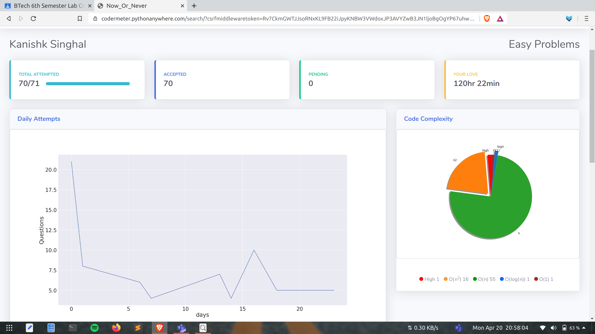

# Progress tracker 
 The tracker help the coder or their mentors to keep track of their daily and overall progress, showing the problems pending to be solved by them with a pie chart of complexities of the questions solved till then and the difficulty of problem stated by the one!
And with this the mentors or anyone can track the progress and get to know whether they're doing good or have to improve their working!!
It uses Django framework and Google APIs to fetch the data from the Google Sheet for the teams under Now or Never and display the dashboard for any member we want to track.  

## Motivation 
  Doing efforts without keeping a track of how well you are doing, whether efforts are fruit-full or not is a waste of time in this compitative world. Having a clean, beautiful and straight to the point prograss tracker can enhance your efforts mutiple times, give you a right direction and keep you motivated to achieve more. 
  
## Tech/framework used
* Python
* Django
* Pandas
* Numpy
* Gspread
* oauth2client
* matplotlib
* HTML, CSS and Bootstrap

## How to use
**Step-1:** Just go to http://codermeter.pythonanywhere.com/
        At the home page Rank list is
        present and Cipher for individual
        progress.
        

**Step-2:** Select the Team from dropdown.
Select Sheet type you want to check
for i.e. Easy, Medium or Hard.
Enter the coder name.
(Enter correct spelling with full name otherwise you'll get the error)
Click the search button.

**Step-3:** Dash board for the individual will be
there.

## For running locally:
**Step-1:** Clone the repo to your system.

**Step-2:** pip install -r requirements.txt

**Step-3:** Navigative to manage.py which is present is task/task_app/ though terminal

**Step-4:** Run the command python manage.py runserver.

**Step-5:** Open any browser and type http://127.0.0.1:8000/ in address bar.

## Credits
**1stRealHackTeam**
Kanishk singhal ||
Vishnu Kumar || 
Ashish Ranjan || 
Tooba Zameer
